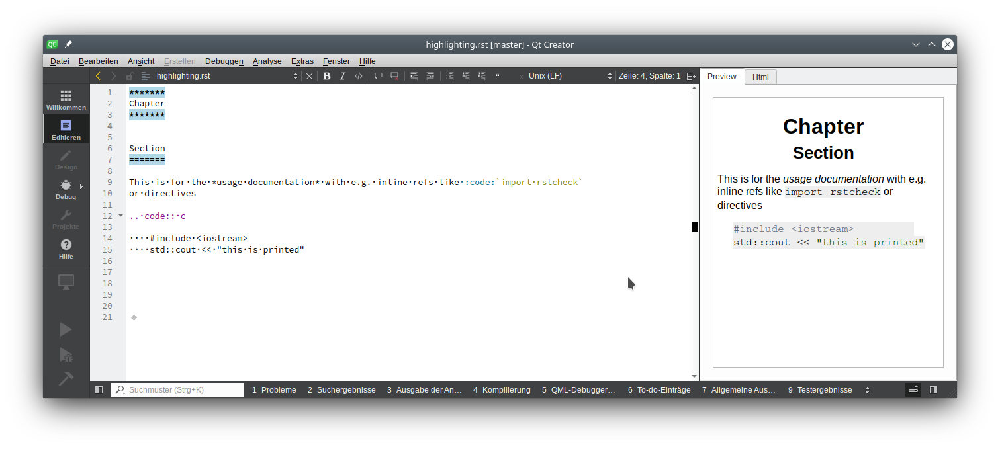
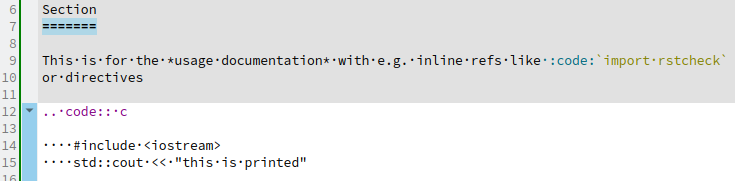
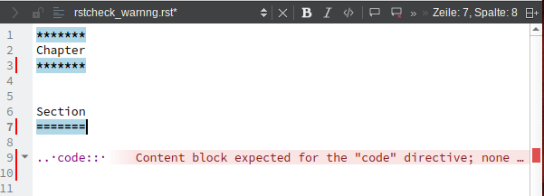
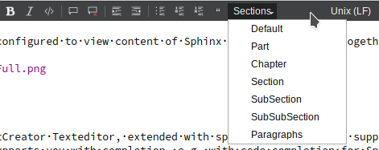
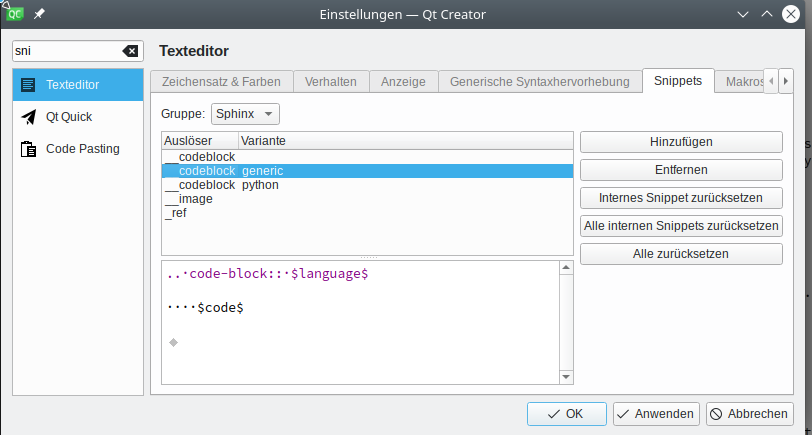
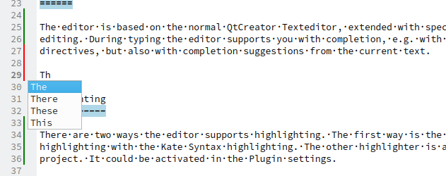
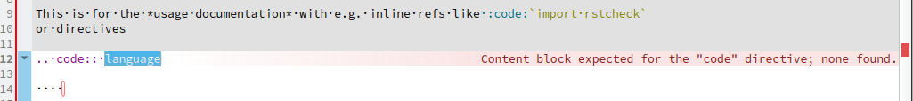
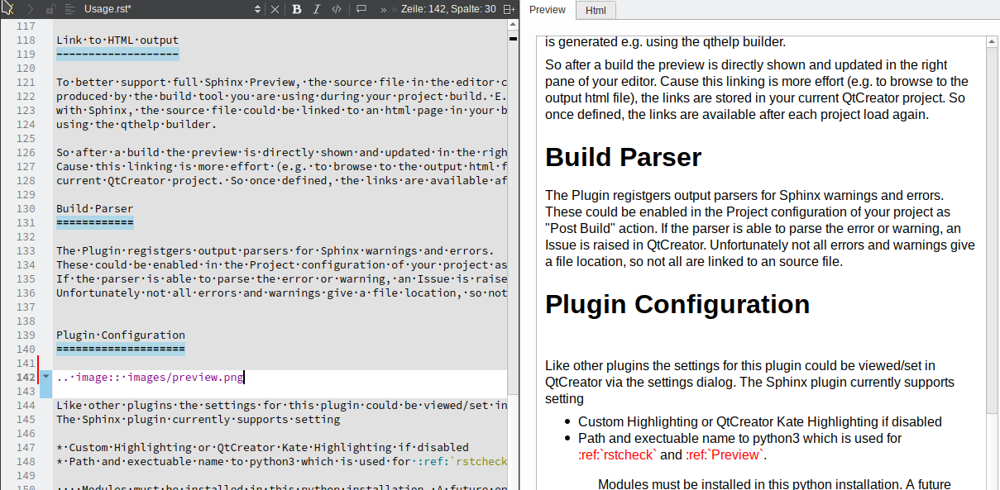
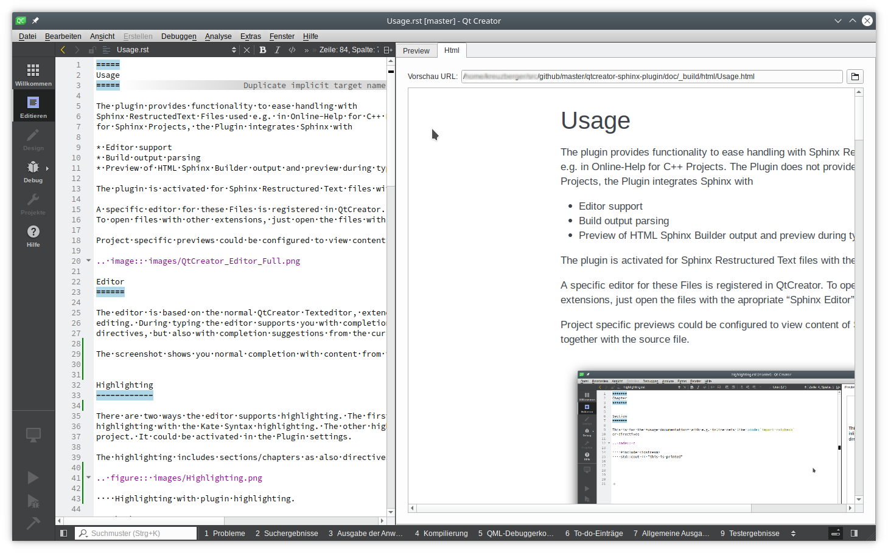
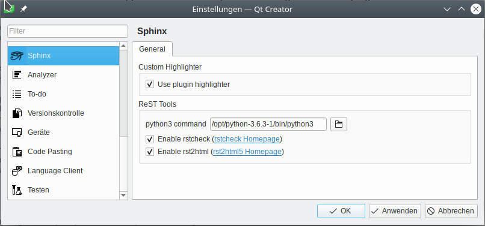

=====
Usage
=====

The plugin provides functionality to ease handling with
Sphinx RestructedText Files used e.g. in Online-Help for C++ Projects. The Plugin does not provide a builder
for Sphinx Projects, the Plugin integrates Sphinx with

* Editor support
* Build output parsing
* Preview of HTML Sphinx Builder output and preview during typing

The plugin is activated for Sphinx Restructured Text files with the exentions "\*.rst". 

A specific editor for these Files is registered in QtCreator.
To open files with other extensions, just open the files with the apropriate "Sphinx Editor".

Project specific previews could be configured to view content of Sphinx files after build together with the source file.

Editor
======

The editor is based on the normal QtCreator Texteditor, extended with specific functions to support ReST
editing. During typing the editor supports you with completion, e.g. with code completion for Sphinx/ReST
directives, but also with completion suggestions from the current text.

The screenshot shows you normal completion with content from the current file.

Highlighting
------------

There are two ways the editor supports highlighting. The first way is the normal QtCreator way to support
highlighting with the Kate Syntax highlighting. The other highlighter is a custom highlighter from this
project. It could be activated in the Plugin settings.

The highlighting includes sections/chapters as also directives and inline roles.

    Highlighting with plugin highlighting.

rstcheck
--------

During typing some errors could occur, most of them could be indentation errors or other ReST syntax errors.
The editor parsers the ReST with `rstcheck <https://pypi.org/project/rstcheck/>`_. This gives you error/warning
hints in the editor like clang warnings during edit of C/C++ source code.

The error/warning information is highlighted and also visible on the right side of the editor.

    rstcheck error hint for empty content in directive

Format Toolbar
--------------

To better support the most common ReST inline roles, the editor has a toolbar with common used inline directives,
most of them reachable via shortcuts. Still missing is a comfortable table editor.

Snippets
--------

To get beyond ReST directives and support faster editing, the plugin gives you the possiblity to define snippets
for directives and roles, that could be activated during typing or are shown as completion hint.

    Demo snippets included in the plugin

Completion
----------

The plugin has stored some basic ReST directives for completion in separate xml files, that are loaded at
QtCreator start and are used to support directive and role completion.

The completion could be extend by the user by adding just more xml files under the share/qtcreator/sphinx/model
directory. The name of the xml file should e.g. match the name of the Sphinx extension this directives/roles are
from. The "model.xsd" file coud be used to check for a valid model xml file.

Unfortunately there is no "standard" for this directive model definitions, so if you write your own you could
please send a pull request to integrate it for other users. Any hint for a better solution is welcome.

    Completion with file content

Also Sphinx/ReST specific directive completion with content is possible, depending on the configured
code models.

    Directive Completion with directive content

Preview
=======

In the right pane of the editor a "Preview" widget is available. The ReST/Sphinx content is parsed with
`rst2html5 <https://pypi.org/project/rst2html5/>`_ to generate this preview. This means that no special
Sphinx directives could be shown or rendered. To avoid many errors in the preview and just to give you
an preview of the formatted normal text, the **rst2html5** module is configured with a low error level.

This could be adapted by the wrapper script for the **rst2html5**, available in 
share/qtcreator/sphinx/rst2html5 directory of the plugin installation. Please be aware that rst2html5
and rstcheck has to be installed in the python installation you have configured for the plugin in the
settings.

For all previews scrolling is still an issue. Cause currently the output does not contain any hints
or informations from where in the source file the output is generated, no good scroll synchronization
could be made. Any hints for getting this better done are welcome.

    Preview of current document

Link to HTML output
-------------------

To better support full Sphinx Preview, the source file in the editor could be linked to an html page
produced by the build tool you are using during your project build. E.g. if you create an online documentation
with Sphinx, the source file could be linked to an html page in your build folder, which is generated e.g.
using the qthelp builder.

So after a build the preview is directly shown and updated in the right pane of your editor.
Cause this linking is more effort (e.g. to browse to the output html file), the links are stored in your
current QtCreator project. So once defined, the links are available after each project load again.

    Link to html output to see fully processed Sphinx output

Build Parser
============

The Plugin registgers output parsers for Sphinx warnings and errors.
These could be enabled in the Project configuration of your project as "Post Build" action.
If the parser is able to parse the error or warning, an Issue is raised in QtCreator.
Unfortunately not all errors and warnings give a file location, so not all are linked to an source file.

Plugin Configuration
====================

Like other plugins the settings for this plugin could be viewed/set in QtCreator via the settings dialog.
The Sphinx plugin currently supports setting

* Custom Highlighting or QtCreator Kate Highlighting if disabled
* Path and exectuable name to python3 which is used for  `rstcheck`_ and `Preview`_.

    Modules must be installed in this python installation. A future enhancment is to check at startup
    if the modules could be used and show appropriate error messages if not.

